# DevSecOps for Frontend Development
### Integrating Security into UI/UX Design and Modern Web Pipelines

> **Academic / demonstration project.** Built for an engineering internship to
> showcase how security scanning tools (ESLint, SonarQube, Snyk) can be
> woven directly into a frontend CI/CD pipeline using GitHub Actions. This
> is **not** a production application — some files intentionally include
> commented-out insecure code patterns alongside their secure counterparts
> purely so the security tooling has realistic issues to detect.

---

## Table of Contents

1. [Project Overview](#project-overview)
2. [Architecture](#architecture)
3. [Project Structure](#project-structure)
4. [Installation](#installation)
5. [Running the Pipeline Locally (no paid SonarCloud/Snyk needed)](#running-the-pipeline-locally-no-paid-sonarcloudsnyk-needed)
6. [CI/CD Pipeline](#cicd-pipeline)
7. [Security Tools Comparison](#security-tools-comparison)
8. [Screenshots](#screenshots)
9. [Future Improvements](#future-improvements)
10. [References](#references)

---

## Project Overview

### What is DevSecOps?

DevSecOps extends the DevOps philosophy — combining development and
operations into a single, automated, continuous workflow — by treating
**security as a shared responsibility integrated at every stage**, rather
than a final gate performed by a separate team right before release. In a
DevSecOps model, security checks (static analysis, dependency scanning,
secret detection, quality gates) run automatically on every commit, giving
developers near-instant feedback while code is still fresh and cheap to fix.

The traditional model — write code, ship it, *then* hand it to a security
team for review — pushes discovery of vulnerabilities to the very end of
the pipeline, where fixes are slowest and most expensive. DevSecOps
"shifts left," moving those checks as early as possible: into the IDE, the
pre-commit hook, and the CI pipeline itself.

### Why Frontend Security Matters

Frontend code is uniquely exposed: it ships directly to the end user's
browser, where it can be inspected, modified, and attacked with nothing
more than developer tools. Unlike backend logic hidden behind an API,
client-side code is effectively public. That makes the frontend a prime
target for:

- **Cross-Site Scripting (XSS)** — injecting malicious scripts that run in
  another user's browser session.
- **Credential and session attacks** — exploiting weak login flows to
  hijack accounts.
- **Supply-chain attacks** — a single compromised or outdated npm package
  can inject malicious code into every app that depends on it.

Because a modern React/Vue/Angular app can easily depend on hundreds or
thousands of transitive packages, frontend security today is as much about
**what you depend on** as **what you write**.

### Key Vulnerability Classes Demonstrated in This Repo

#### DOM-based XSS
DOM-XSS occurs when untrusted data (user input, URL parameters, etc.) is
written into the DOM in a way that lets an attacker execute arbitrary
JavaScript — commonly through `innerHTML`, `outerHTML`,
`document.write()`, or React's `dangerouslySetInnerHTML`. Because the
payload never needs to touch the server, it can bypass server-side input
filtering entirely. Once executed, an attacker's script runs with the same
privileges as the legitimate page — meaning it can steal session tokens,
read local storage, log keystrokes, or silently perform actions as the
victim. See `src/components/CommentBox.jsx` for a fully commented
insecure-vs-secure comparison, and `.eslintrc.json` for the
`no-unsanitized` / `react/no-danger` rules that catch this pattern
automatically.

#### Broken Login Flows
A "broken" login flow is any authentication implementation that trusts
the client more than it should — for example, relying on client-side
validation as the *only* gatekeeper, storing authorization flags
(`isAdmin`) in `localStorage`, or granting access to protected views
purely based on frontend routing rather than a verified server session.
Because all client-side code and state is attacker-controlled, these
patterns can be trivially bypassed. See `src/Login.jsx` for the
insecure-vs-secure comparison and explanation.

#### Insecure / Outdated Dependencies
Modern frontend apps sit on top of an enormous dependency tree. A single
outdated package with a known CVE — even one buried three levels deep in
`node_modules` — can expose the whole application to prototype pollution,
remote code execution, or data exfiltration. High-profile incidents
(e.g. the 2018 `event-stream` npm supply-chain compromise) show these
risks are not theoretical. This repo intentionally pins an outdated
`lodash` version (see `package.json`) purely so Snyk's dependency scan in
CI has a real, documented finding to surface.

### Why These Vulnerabilities Are Dangerous

All three classes share a common thread: they let an attacker act **as
if they were a legitimate part of the application or its user**. XSS lets
attacker code run with the page's own privileges. Broken login flows let
an attacker skip authentication entirely. Vulnerable dependencies let
attacker-controlled code ship inside your own bundle. In each case, the
blast radius extends beyond the vulnerable component itself to every user
session, every piece of data the page can touch, and — in the case of
supply-chain compromise — potentially every downstream consumer of the
package. Automated scanning in CI is what makes catching these issues
consistent and immediate rather than dependent on manual review.

---

## Architecture

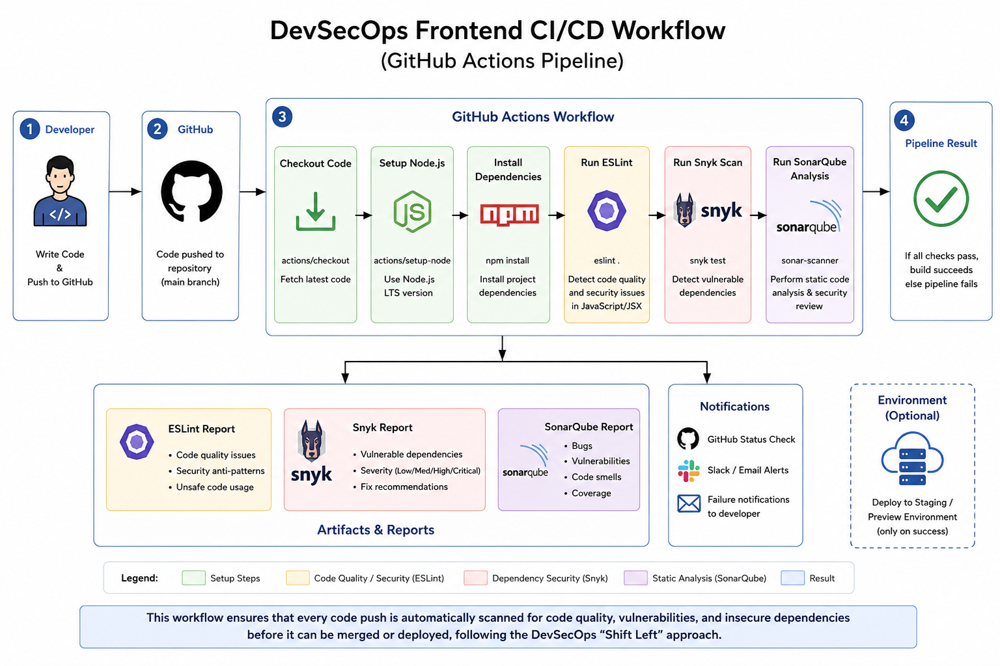

```
Developer
    │
    ▼
GitHub Push / Pull Request
    │
    ▼
GitHub Actions Workflow (.github/workflows/security.yml)
    │
    ├── Install Dependencies (npm install)
    │
    ├── ESLint ─────────────► Static Application Security Testing (SAST)
    │                          - security & no-unsanitized plugin rules
    │                          - react-specific safety rules
    │
    ├── Build (npm run build)
    │
    ├── Snyk ───────────────► Software Composition Analysis (SCA)
    │                          - scans package.json / lockfile
    │                          - flags known-vulnerable dependencies
    │
    ├── SonarQube ───────────► Static Analysis + Quality Gate
    │                          - code smells, bugs, security hotspots
    │                          - merges ESLint + coverage reports
    │
    ▼
Security Report
    │
    ├── GitHub Actions job summary / annotations
    ├── SonarQube dashboard (quality gate pass/fail)
    └── Snyk dashboard (vulnerability list + severity)
```

Every stage runs automatically on each push/PR, so a vulnerability
introduced in a single commit is surfaced before it can ever reach `main`.

---

## Project Structure

```
frontend-devsecops-demo/
├── src/
│   ├── App.jsx                  # Root component; client-side routing setup
│   ├── Login.jsx                # Login page - insecure vs secure validation demo
│   ├── Dashboard.jsx            # Post-login page, hosts the CommentBox demo
│   ├── index.js                 # React entry point (ReactDOM root render)
│   ├── index.css                # Global stylesheet
│   └── components/
│       ├── Navbar.jsx           # Simple navigation bar
│       └── CommentBox.jsx       # DOM-XSS insecure vs secure (DOMPurify) demo
├── public/
│   └── index.html               # HTML shell, includes an example CSP meta tag
├── package.json                 # Dependencies, scripts, intentional outdated pkg
├── .eslintrc.json                # ESLint config with security-focused plugins
├── sonar-project.properties     # SonarQube/SonarCloud project configuration
├── .snyk                        # Snyk policy file (ignore/patch rules)
├── docker-compose.yml            # Local SonarQube Community Edition (free, via Docker)
├── .secrets.example              # Template for local `act` secrets (SNYK_TOKEN, SONAR_TOKEN, etc.)
├── .gitignore                   # Standard Node/React ignore rules
├── .github/
│   └── workflows/
│       ├── security.yml         # CI pipeline: install → lint → build → scan
│       └── deploy-pages.yml     # Builds and publishes to GitHub Pages (gh-pages branch)
└── README.md                    # This file
```

**`src/`** — All application source code. Organized flat at the top level
for the two pages (`Login`, `Dashboard`, `App`) with shared UI pieces
under `components/`.

**`public/`** — Static assets served as-is; contains the single HTML shell
that React mounts into (`#root`), including a demo Content-Security-Policy.

**`.github/workflows/`** — GitHub Actions CI/CD pipeline definitions. This
is the automation layer that ties together linting, building, and both
security scanners.

**Root config files** (`.eslintrc.json`, `sonar-project.properties`,
`.snyk`) — Tool-specific configuration, each explained in its own section
below.

---

## Installation

Requires **Node.js 18+** and **npm 9+**.

```bash
# 1. Clone the repository
git clone https://github.com/<your-username>/frontend-devsecops-demo.git
cd frontend-devsecops-demo

# 2. Install dependencies
npm install

# 3. Start the development server
npm start
```

The app will be available at **http://localhost:3000**.

Other useful scripts:

```bash
npm run build      # Production build (output in build/)
npm test           # Run unit tests
npm run lint       # Run ESLint against src/
npm run lint:fix   # Run ESLint and auto-fix what it can
npm run deploy     # Build and publish build/ to the gh-pages branch
```

### Deploying to GitHub Pages

GitHub Pages serves static files as-is — it does not run `npm install` or
`npm run build` for you. Pushing source code alone (as in this repo's
`main` branch) is not enough; you must publish the **built** app.

**Option A — one-off manual deploy:**

```bash
npm install
npm run deploy
```

This builds the app and pushes the `build/` folder to a `gh-pages`
branch (via the `gh-pages` npm package). Then, in your repo, go to
**Settings → Pages → Build and deployment → Source: "Deploy from a
branch"** and select the **`gh-pages`** branch, **`/ (root)`** folder.

**Option B — automatic deploy on every push:**
[`.github/workflows/deploy-pages.yml`](.github/workflows/deploy-pages.yml)
builds and publishes to `gh-pages` automatically on every push to `main`.
After its first successful run, point **Settings → Pages** at the
`gh-pages` branch as in Option A, and future pushes will redeploy
automatically — no manual `npm run deploy` needed.

> **Why HashRouter?** This app uses React Router's `HashRouter` (URLs
> look like `.../#/dashboard`) rather than `BrowserRouter`. GitHub Pages
> has no server to rewrite deep-link requests (e.g. a direct visit to
> `/dashboard`) back to `index.html`, so `BrowserRouter` would 404 on
> refresh. `HashRouter` keeps all routing client-side after the single
> `index.html` loads, avoiding that problem entirely.

---

## Running the Pipeline Locally (no paid SonarCloud/Snyk needed)

This project was built and graded as a **local demonstration**, not a
hosted service — there's no requirement to keep a live GitHub Pages demo
or a paid SonarCloud/Snyk plan running. Instead, the full pipeline
(ESLint → build → Snyk → SonarQube) can be run entirely on a local
machine using free tooling, and the results captured as screenshots for
submission.

### 1. Spin up a local SonarQube server (Community Edition, via Docker)

SonarQube's free **Community Edition** runs fine in Docker and doesn't
require any paid plan:

```bash
docker compose up -d
```

This uses [`docker-compose.yml`](docker-compose.yml) to start SonarQube
CE on **http://localhost:9000**. First login is `admin` / `admin`
(you'll be forced to set a new password immediately). Once logged in,
generate a token under **My Account → Security → Generate Tokens** —
you'll need it below.

To stop it: `docker compose down`. To fully wipe local data/projects:
`docker compose down -v`.

### 2. Get a free Snyk token

See the [Snyk](#snyk) section below — the free personal token (not the
paid Enterprise API/service-accounts feature) is all that's needed for
CLI/CI scanning.

### 3. Run the workflow locally with `act`

[`act`](https://github.com/nektos/act) runs GitHub Actions workflows
locally in Docker, so you can execute `.github/workflows/security.yml`
without pushing to GitHub or paying for hosted runners/tools.

```bash
# Install act (macOS example - see act's docs for Windows/Linux):
brew install act

# Copy the secrets template and fill in real values:
cp .secrets.example .secrets

# Run the security pipeline job:
act -j build-and-scan --secret-file .secrets
```

`.secrets.example` documents each value, including the important detail
that `SONAR_HOST_URL` must point at `host.docker.internal:9000` (not
`localhost:9000`) so the containerized `act` runner can reach the
SonarQube container running on your host machine.

### Known local/offline quirks

- The **SonarQube Quality Gate check** step polls a webhook that a fresh
  local SonarQube CE instance isn't configured to send. It's marked
  `continue-on-error: true` in the workflow specifically so local runs
  complete and still produce a report, rather than hanging or failing
  the whole job while waiting on a webhook that will never arrive.
- `act` doesn't perfectly emulate every GitHub-hosted feature (e.g. some
  artifact-upload/summary UI won't render the same as on github.com) —
  this is expected and doesn't affect whether ESLint/Snyk/SonarQube
  actually ran and produced findings.
- For submission, take screenshots of: the `act` terminal output showing
  each step completing, the ESLint findings, the Snyk vulnerability
  report, and the local SonarQube dashboard at `localhost:9000` — see
  [Screenshots](#screenshots) below.

---

## CI/CD Pipeline

Defined in [`.github/workflows/security.yml`](.github/workflows/security.yml),
the pipeline runs on every push and pull request to `main`:

| Step | Purpose |
|---|---|
| **Checkout repository** | Pulls the source code onto the runner. Full git history is fetched so SonarQube can compute accurate new-code and blame metrics. |
| **Set up Node.js** | Installs Node 20 and enables npm's built-in dependency cache for faster repeat runs. |
| **Install dependencies** | Runs `npm install`, resolving all packages listed in `package.json`/lockfile — including the intentionally outdated demo package Snyk is meant to catch. |
| **Run ESLint** | Executes the security-aware ESLint config (see below) against `src/`, producing both a JSON report artifact and human-readable console output. The build fails if ESLint reports errors. |
| **Build React app** | Runs `npm run build` to produce an optimized production bundle, confirming the app still compiles cleanly after linting. |
| **Run tests with coverage** | Executes the test suite with coverage collection, feeding SonarQube's coverage metrics. Marked `continue-on-error` since this demo ships minimal tests. |
| **Run Snyk** | Performs Software Composition Analysis against `package.json`/lockfile, flagging known-CVE dependencies (e.g. the outdated `lodash` pin). Uses `SNYK_TOKEN` from GitHub Secrets. |
| **SonarQube Scan** | Uploads source, coverage, and ESLint reports to SonarQube/SonarCloud for centralized static analysis (bugs, code smells, security hotspots). Uses `SONAR_TOKEN` / `SONAR_HOST_URL` from GitHub Secrets. |
| **SonarQube Quality Gate check** | Polls the analysis result and fails the workflow if the project doesn't meet the configured quality/security bar. |
| **Upload artifacts** | Publishes the ESLint report and production build as downloadable GitHub Actions artifacts for manual review. |

### Required GitHub Secrets

Configure these under **Repo Settings → Secrets and variables → Actions**:

| Secret | Description |
|---|---|
| `SNYK_TOKEN` | Your personal/org Snyk API token (see [Snyk](#snyk) below for how to obtain it). |
| `SONAR_TOKEN` | Authentication token generated in SonarQube/SonarCloud for this project. |
| `SONAR_HOST_URL` | URL of your SonarQube server. Omit or leave unset when using SonarCloud. |

---

## ESLint

Configured in [`.eslintrc.json`](.eslintrc.json) with two security-focused
plugins layered on top of standard React rules:

- **`eslint-plugin-security`** — heuristic detectors for classic
  Node/JS injection risks (`eval`, dynamic `require`, unsafe regexes,
  unsafe filesystem paths, object injection).
- **`eslint-plugin-no-unsanitized`** — flags unsanitized data flowing
  into `innerHTML`/`outerHTML`/`insertAdjacentHTML`, the root cause of
  most DOM-based XSS bugs.
- **`react/no-danger`** — the React-specific equivalent, catching any use
  of `dangerouslySetInnerHTML` that isn't explicitly justified.

Every rule enabled in `.eslintrc.json` is explained below:

| Rule | What it does | Why it matters |
|---|---|---|
| `no-shadow` | Disallows a variable declaration from shadowing an outer-scope variable. | Prevents subtle bugs where an inner variable unintentionally hides an outer one, which can mask logic and security checks. |
| `eqeqeq` | Requires `===`/`!==` instead of `==`/`!=`. | Loose equality performs type coercion, which has historically enabled logic bugs and even authentication bypasses (e.g. `"0" == false`, `null == undefined`). |
| `no-eval` | Disallows `eval()`. | `eval()` executes arbitrary strings as JavaScript — one of the most dangerous code-injection vectors in any language. |
| `no-implied-eval` | Disallows `setTimeout`/`setInterval`/`Function` called with a string argument. | These behave like `eval()` under the hood and carry the same injection risk. |
| `no-new-func` | Disallows the `Function` constructor built from strings. | Another `eval()`-equivalent injection vector. |
| `no-unused-vars` | Flags declared-but-unused variables. | Reduces dead code and leftover debug/test code that can leak logic or information. |
| `no-console` | Warns on `console.log` (allows `warn`/`error`). | Prevents accidental leakage of sensitive debug information into browser consoles/logs. |
| `react/no-danger` | Flags any use of `dangerouslySetInnerHTML`. | The single most important rule for catching DOM-based XSS in React; forces every use to be a deliberate, reviewed exception (as in `CommentBox.jsx`). |
| `react/jsx-no-target-blank` | Requires `rel="noopener noreferrer"` on `target="_blank"` links. | Without `noopener`, the opened tab can access `window.opener` and redirect the original tab to a phishing page (reverse tabnabbing). |
| `react/react-in-jsx-scope` | Disabled — not required with the modern JSX transform. | Kept explicit here for readability/traceability in this project's import style. |
| `react/prop-types` | Disabled in this demo. | This project doesn't use PropTypes/TypeScript; flagged here as a known area for future hardening. |
| `security/detect-child-process` | Flags `child_process` calls with dynamic input. | Can lead to OS command injection; mostly relevant to Node build scripts. |
| `security/detect-non-literal-require` | Flags dynamic `require()` calls. | Can allow loading of arbitrary modules/files. |
| `security/detect-non-literal-regexp` | Flags regexes built from dynamic input. | Can be vulnerable to ReDoS (Regular Expression Denial of Service). |
| `security/detect-pseudoRandomBytes` | Flags weak/predictable use of Node's `crypto` module. | Encourages review of any cryptographic code path. |
| `security/detect-unsafe-regex` | Flags patterns commonly associated with ReDoS. | Catches nested-quantifier regexes before they hang the event loop. |
| `security/detect-non-literal-fs-filename` | Flags dynamic values flowing into filesystem paths. | Can enable path traversal (`../../etc/passwd`) attacks. |
| `security/detect-object-injection` | Flags dynamic bracket-notation property access/assignment. | Can lead to prototype pollution vulnerabilities. |
| `no-unsanitized/method` / `no-unsanitized/property` | Flags unsanitized data passed to `innerHTML`/`outerHTML`/`insertAdjacentHTML`. | This is the core DOM-XSS detector this project is built to showcase; complements `react/no-danger` by also covering plain (non-React) DOM APIs. |

---

## SonarQube

Configuration lives in [`sonar-project.properties`](sonar-project.properties),
targeted at a standard Create-React-App-style source layout (`src/`).
It wires in:

- ESLint's JSON report (`sonar.eslint.reportPaths`), so SonarQube's
  dashboard reflects the same findings as CI's ESLint step.
- Test coverage via `lcov` (`sonar.javascript.lcov.reportPaths`).
- Standard exclusions for `node_modules`, `build`, and `public`.

**Required GitHub Secrets:** `SONAR_TOKEN` and `SONAR_HOST_URL` (the
latter is unnecessary if you're using SonarCloud, which defaults to
`https://sonarcloud.io`). Generate a token from your SonarQube/SonarCloud
account under **My Account → Security → Generate Token**, then add it as
a repository secret.

---

## Snyk

Snyk performs Software Composition Analysis (SCA) — scanning declared and
transitive dependencies against a continuously updated vulnerability
database. The [`.snyk`](.snyk) policy file documents (but does not
suppress) the intentionally outdated `lodash` dependency in
`package.json`, so it remains visible in scan output as a teaching
example, along with commented-out syntax showing how a real project would
temporarily ignore an accepted-risk finding.

### How to obtain a Snyk token

1. Create a free account at [snyk.io](https://snyk.io).
2. Go to **Account Settings → General → Oersonal Access Token** (or run `snyk auth`
   locally with the Snyk CLI to authenticate interactively).
3. Copy the generated API.
4. Add it to your GitHub repository as a secret named `SNYK_TOKEN`
   (**Repo Settings → Secrets and variables → Actions → New repository
   secret**).

The CI workflow references this token via `${{ secrets.SNYK_TOKEN }}` and
never exposes it in logs.

---

## Security Tools Comparison

| Tool | Purpose | Strengths | Weaknesses |
|---|---|---|---|
| **ESLint** (+ security plugins) | Static Application Security Testing (SAST) at the source-code level; catches unsafe patterns as code is written. | Fast, runs in-editor and pre-commit; zero network dependency; highly configurable rule-by-rule; immediate developer feedback. | Pattern/heuristic-based — can produce false positives/negatives; limited cross-file/data-flow analysis; doesn't scan dependencies. |
| **SonarQube** | Broader static analysis: bugs, code smells, maintainability, and security hotspots, aggregated into a dashboard with a pass/fail Quality Gate. | Centralized, historical tracking across the whole codebase; enforces org-wide quality/security standards; integrates multiple languages and tool outputs (e.g. ESLint reports) in one place. | Requires hosting/maintaining a server (or a SonarCloud subscription); rule tuning has a learning curve; can be noisy without careful gate configuration. |
| **Snyk** | Software Composition Analysis (SCA); scans dependencies for known CVEs and license issues, with automated fix PRs. | Continuously updated vulnerability database; suggests concrete upgrade paths; strong npm/yarn ecosystem support; low-friction CI integration. | Doesn't analyze your own application logic (no custom-code SAST on the free tier); scan quality depends on lockfile accuracy; can generate alert fatigue on legacy dependency trees. |

Used together, these three tools cover complementary layers: ESLint
catches unsafe *code you wrote*, SonarQube aggregates quality/security
signal across the *whole codebase*, and Snyk protects against risk
introduced by *code you didn't write* (your dependencies).

---

## Screenshots

This project is demonstrated via local pipeline runs (see
[Running the Pipeline Locally](#running-the-pipeline-locally-no-paid-sonarcloudsnyk-needed))
rather than a permanently hosted live deployment. Add screenshots here
after running `npm start` and `act -j build-and-scan` at least once:

### Application Interface

#### Login & Dashboard

The application demonstrates a secure frontend login flow, password validation,
and DOM-XSS protection using DOMPurify.

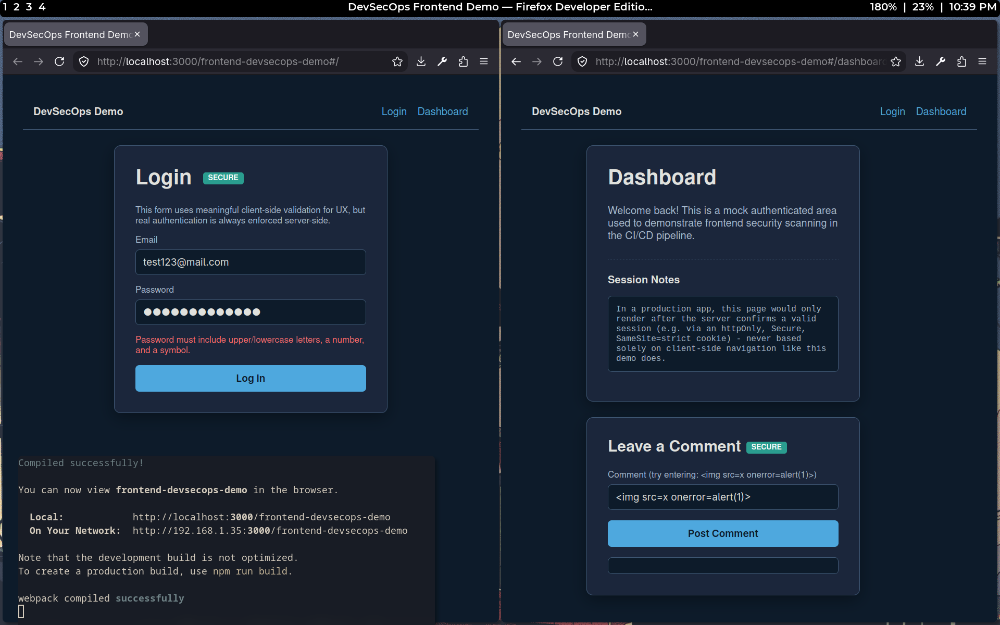

---

### GitHub Actions Pipeline

The complete DevSecOps pipeline executes automatically using GitHub Actions,
performing installation, linting, build validation, dependency scanning,
SonarQube analysis, and artifact generation.

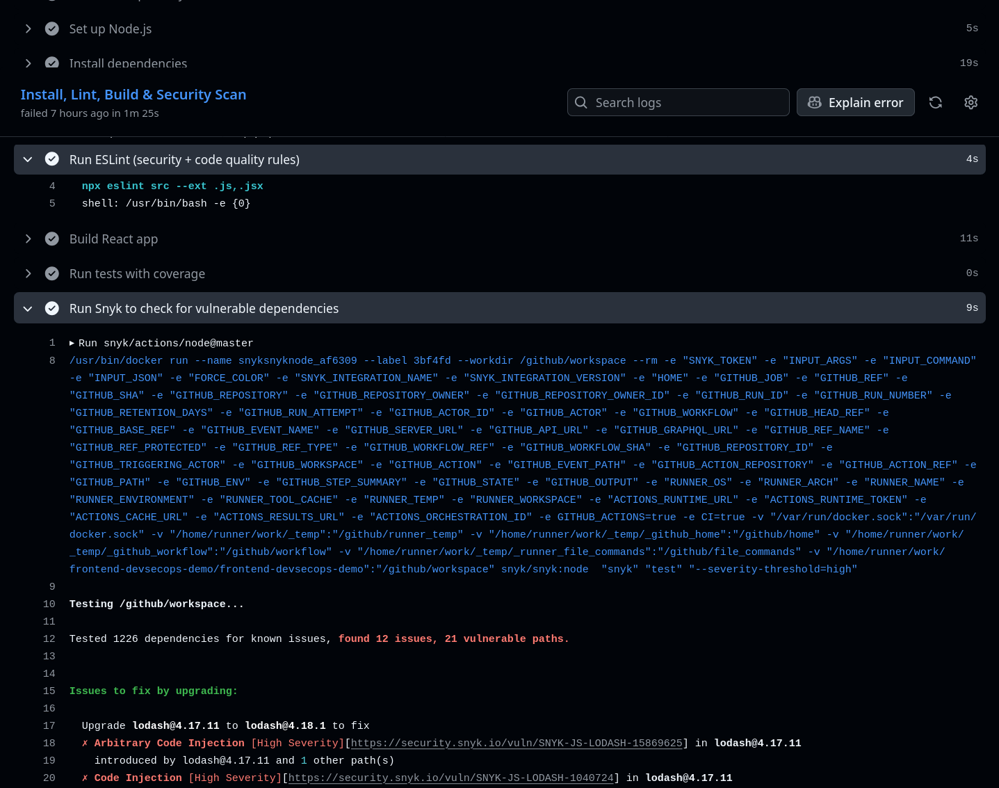

---

### SonarQube Analysis

#### Project Dashboard

Shows the overall Quality Gate status and maintainability metrics after static
analysis.

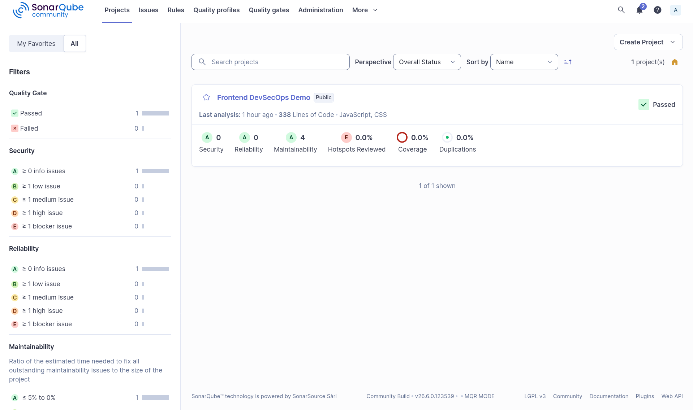

#### Issues Overview

SonarQube identifies maintainability issues and highlights the affected source
code with recommendations.

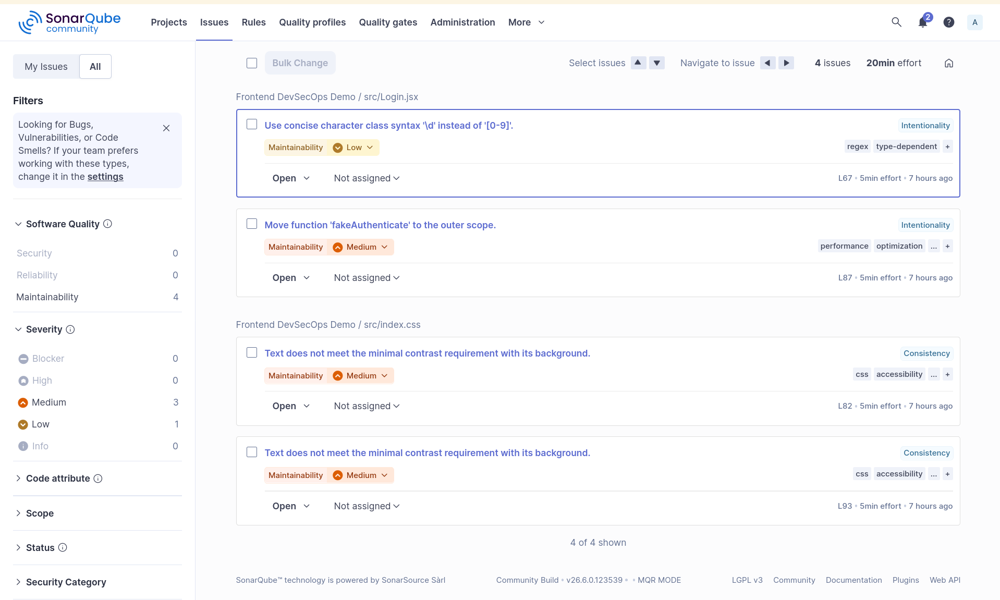

#### Issue Details

Example issue showing inline code analysis and suggested improvements.

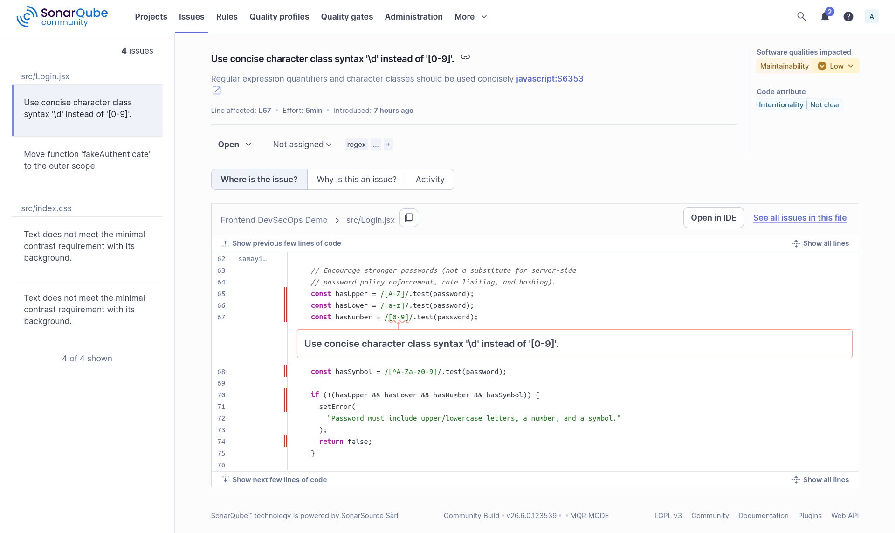

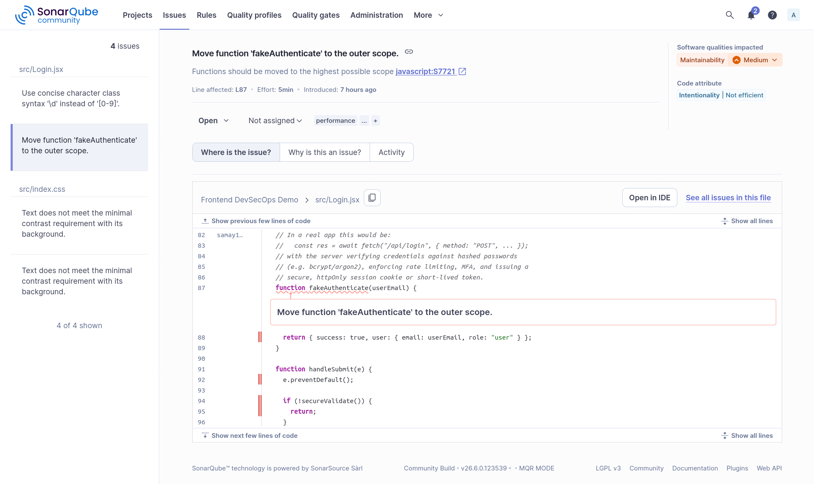

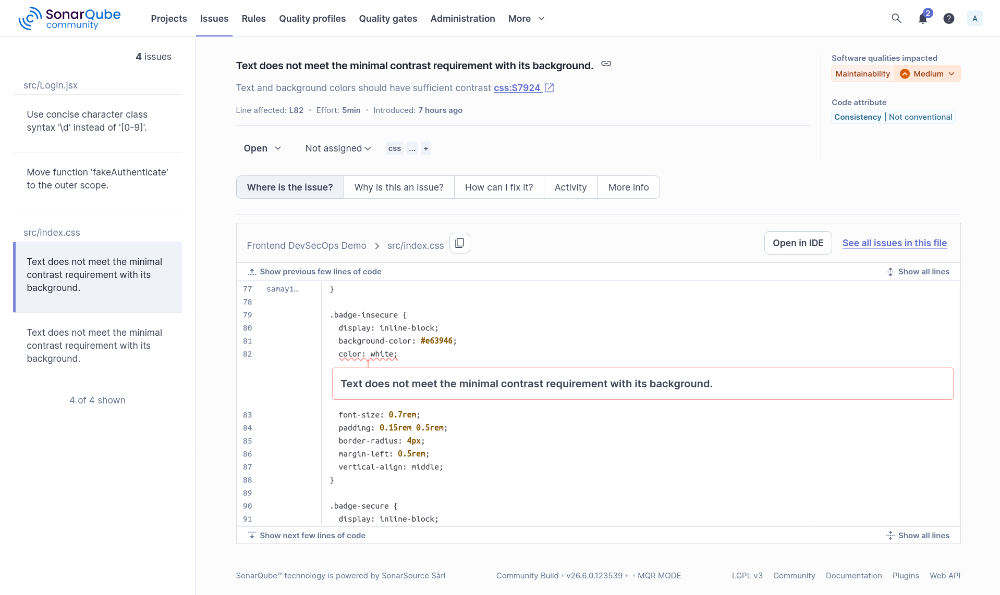

---

### Snyk Dependency Scanning

Snyk performs Software Composition Analysis (SCA) by scanning project
dependencies for known vulnerabilities.

#### Vulnerability Summary

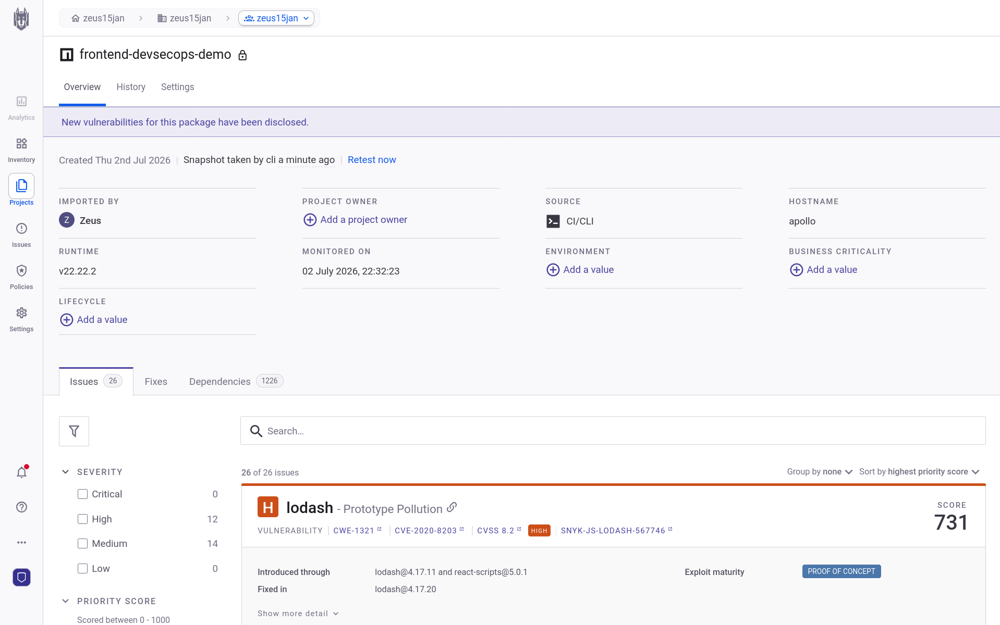

#### Dependency Graph

Shows vulnerable packages and their dependency paths.

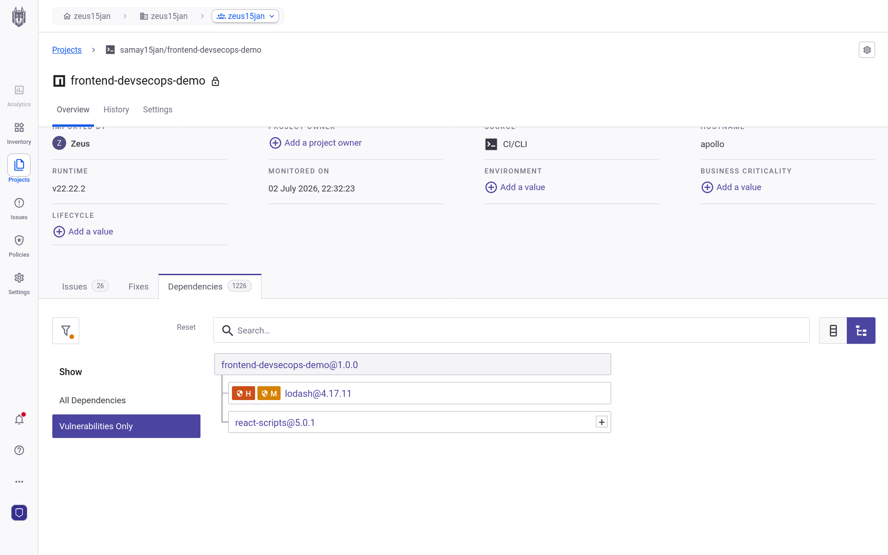

#### Vulnerability Details

Examples of detected dependency vulnerabilities and recommended fixes.

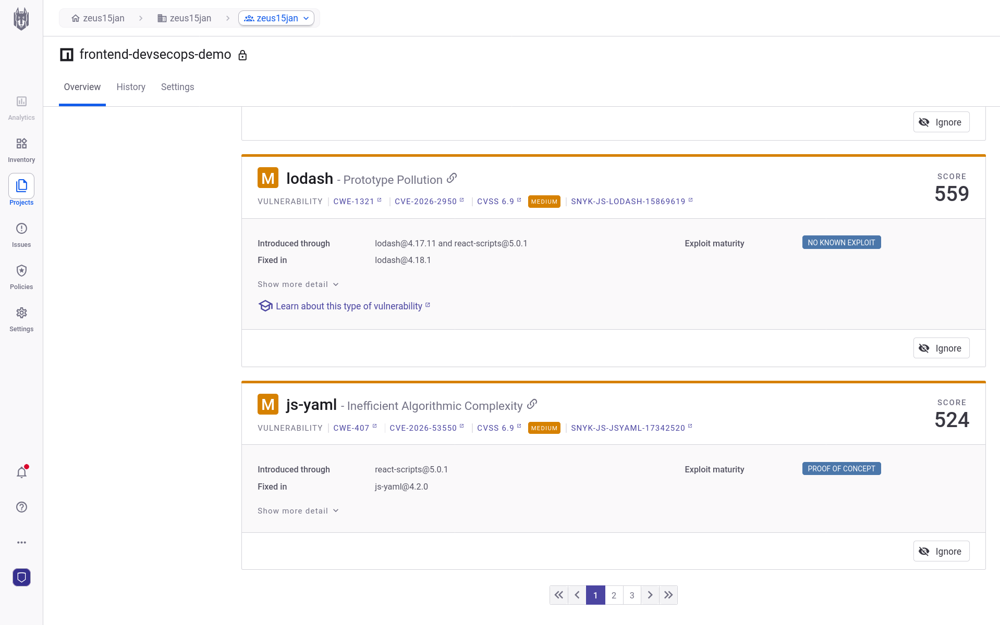

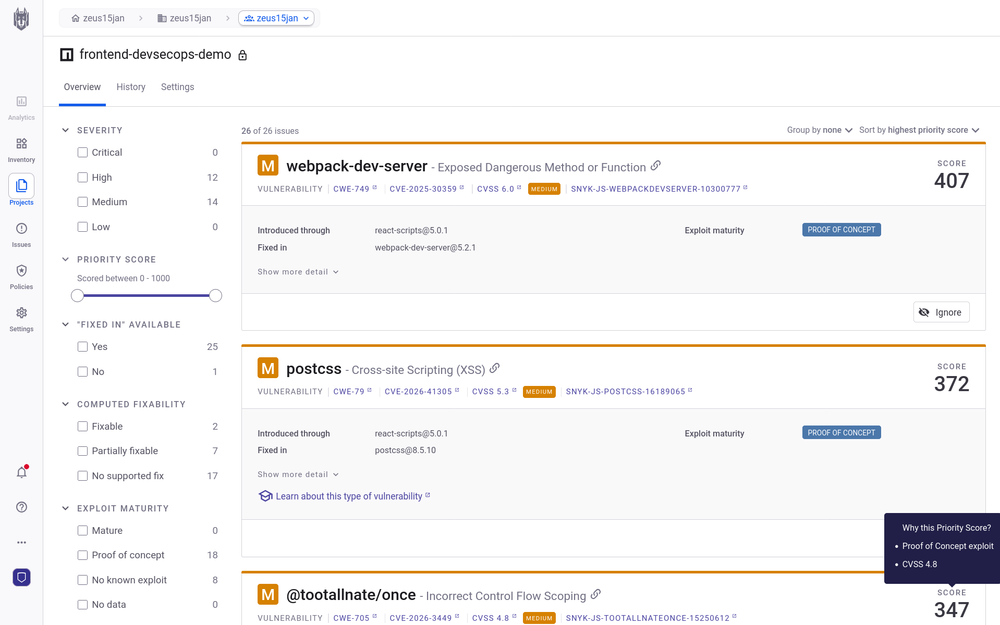

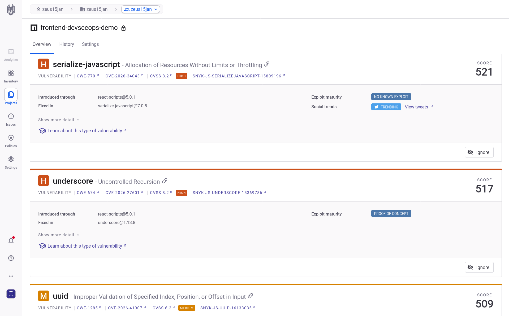

---

### Local Pipeline Execution

Execution of the complete DevSecOps workflow using GitHub Actions (`act`) in a
local environment.

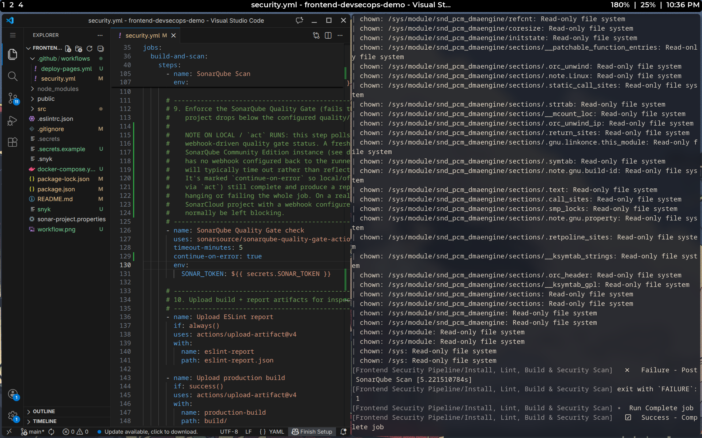


---

## Future Improvements

This demo covers SAST, SCA, and quality-gate enforcement. A more complete
DevSecOps pipeline could add:

- **OWASP ZAP** — Dynamic Application Security Testing (DAST) against a
  running instance of the app, catching runtime issues static analysis
  can't see (e.g. misconfigured headers, live auth flow probing).
- **Dependabot** — automated pull requests that keep dependencies patched
  on an ongoing basis, complementing Snyk's point-in-time scans.
- **CodeQL** — GitHub's native semantic code analysis engine, offering
  deeper data-flow-aware SAST than pattern-based linting alone.
- **Docker** — containerizing the build/runtime environment for
  reproducible builds and to enable container image scanning.
- **Kubernetes** — for teams deploying at scale, adding manifest
  scanning (e.g. via `kube-score` or `Trivy`) and runtime policy
  enforcement (e.g. via OPA/Gatekeeper).

---

## References

- [SonarQube Documentation](https://docs.sonarsource.com/sonarqube/)
- [Snyk Documentation](https://docs.snyk.io/)
- [ESLint Documentation](https://eslint.org/docs/latest/)
- [OWASP Foundation](https://owasp.org/)
- [OWASP Top 10](https://owasp.org/www-project-top-ten/)
- [GitHub Actions Documentation](https://docs.github.com/en/actions)

---

## License

MIT — this repository is provided for educational purposes as part of an
engineering internship project.
